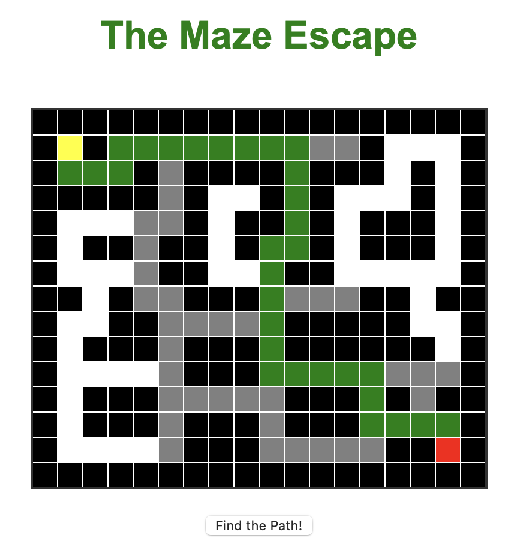

# 🧭 The Maze Escape — A* Pathfinding Visualization



**The Maze Escape** is an interactive visualization of the **A\*** (A-star) pathfinding algorithm.
It demonstrates how the algorithm explores possible routes and finds the shortest path through a maze in real time.

## 🌟 Features
- Dynamic A* algorithm animation  
- Clear visualization of walls, open paths, visited nodes, and the final path  
- Adjustable maze structure (you can modify the 2D array)  
- Simple, intuitive UI built with HTML, CSS, and JavaScript

## 🧩 How It Works
- The maze is represented by a 2D array (`0` — path, `1` — wall).  
- The algorithm searches for the shortest path from the start point to the end point.  
- Each step is animated:
  - 🟩 **Visited** — cells that have been checked  
  - 🟨 **Path Found** — cells forming the shortest route  
  - 🟥 **Start** and 🟦 **End** points are marked distinctly

## 🚀 Run Locally
```bash
git clone https://github.com/noname27cloud/the-maze-escape.git
cd the-maze-escape
# Open index.html in your browser
# Or use a static server:
npx http-server .   # or python -m http.server 8000


